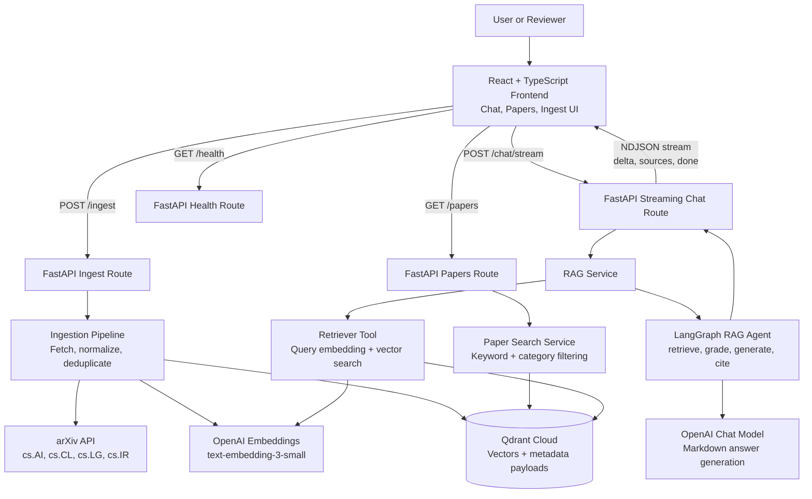

# ResearchOps AI

**Enterprise Agentic RAG for Live AI Paper Intelligence**

ResearchOps AI is a portfolio-ready AI engineering project that ingests live AI research papers from arXiv, stores semantic embeddings and paper metadata in Qdrant Cloud, and exposes a FastAPI + React application for paper search and streaming RAG chat with source citations.

The project is designed for hiring managers and technical reviewers to evaluate practical AI application engineering skills: external API integration, ingestion pipelines, vector databases, LangGraph-based agentic RAG, streaming LLM UX, source-grounded answers, typed backend APIs, a modern frontend, Docker packaging, and test coverage.

## What This Project Demonstrates

- **Live data ingestion:** fetches recent AI papers from arXiv categories `cs.AI`, `cs.CL`, `cs.LG`, and `cs.IR`.
- **Production-style RAG pipeline:** embeds paper title + abstract, stores vectors in Qdrant Cloud, retrieves relevant context, and generates grounded answers.
- **Agentic workflow:** uses LangGraph to structure the RAG flow around retrieval, context handling, answer generation, and citation formatting.
- **Streaming UX:** streams chat responses from the backend to the React frontend and renders answers as Markdown.
- **Source citations:** returns paper titles and PDF URLs from Qdrant payload metadata.
- **Search experience:** supports keyword and category search over ingested paper metadata.
- **Operational hygiene:** environment-based secrets, structured logging, Docker Compose, `.env.example`, and tests for core backend behavior.

## Application Architecture



## End-to-End Flow

1. A reviewer starts the app locally or with Docker Compose.
2. The user clicks **Ingest**.
3. The backend calls arXiv, normalizes paper data, removes duplicate arXiv versions, embeds title + abstract, creates the Qdrant collection if needed, and upserts vectors with metadata payloads.
4. The user searches papers by keyword or category.
5. The user asks a research question in chat.
6. The backend embeds the question, retrieves relevant papers from Qdrant, passes grounded context into the LangGraph RAG agent, streams a Markdown-formatted answer, and returns source citations.
7. The frontend renders the streamed answer progressively and displays paper sources as links.

## Tech Stack

| Area | Tools |
| --- | --- |
| Backend | Python 3.12, FastAPI, Pydantic, Uvicorn |
| Agent/RAG | LangGraph, OpenAI Chat Completions, OpenAI Embeddings |
| Vector DB | Qdrant Cloud |
| Frontend | React, TypeScript, Vite, lucide-react, react-markdown |
| Infrastructure | Docker, Docker Compose, Nginx frontend container |
| Testing | Python `unittest`, in-memory Qdrant client |

## Repository Structure

```text
researchops-ai/
├── backend/
│   ├── agents/          # LangGraph RAG agent, state, retriever tool
│   ├── api/             # FastAPI route modules
│   ├── core/            # settings, logging, middleware
│   ├── ingestion/       # arXiv client, normalizer, ingestion pipeline
│   ├── schemas/         # Pydantic request/response models
│   ├── services/        # embeddings, Qdrant, search, RAG orchestration
│   ├── main.py
│   └── Dockerfile
├── frontend/
│   ├── src/
│   │   ├── api/         # typed backend API client
│   │   ├── types/       # frontend API types
│   │   ├── App.tsx
│   │   └── styles.css
│   ├── Dockerfile
│   └── nginx.conf
├── tests/               # unit tests for ingestion and Qdrant behavior
├── docs/                # PRD and architecture documentation
├── docker-compose.yml
├── .env.example
└── README.md
```

## Key Backend APIs

| Endpoint | Method | Purpose |
| --- | --- | --- |
| `/health` | `GET` | Health check for backend availability. |
| `/ingest` | `POST` | Fetch recent arXiv papers, embed them, and store them in Qdrant. |
| `/papers` | `GET` | Search ingested paper metadata by keyword and category. |
| `/chat` | `POST` | Non-streaming RAG response with answer and sources. |
| `/chat/stream` | `POST` | Streaming RAG response as newline-delimited JSON events. |

## Environment Variables

Create a local `.env` file from the example:

```bash
cp .env.example .env
```

Required values:

```env
OPENAI_API_KEY=
QDRANT_URL=
QDRANT_API_KEY=
```

Recommended defaults:

```env
OPENAI_CHAT_MODEL=gpt-4.1-mini
OPENAI_EMBEDDING_MODEL=text-embedding-3-small
QDRANT_COLLECTION_NAME=research_papers
QDRANT_VECTOR_SIZE=1536
ARXIV_BASE_URL=https://export.arxiv.org/api/query
```

The Qdrant collection is created automatically during ingestion. You do not need to create it manually.

## Run Locally

Prerequisites:

- Python 3.12+
- `uv`
- Node.js 22+
- OpenAI API key
- Qdrant Cloud URL and API key

Install backend dependencies:

```bash
uv sync
```

Start the backend:

```bash
uv run uvicorn backend.main:app --host 127.0.0.1 --port 8000
```

Install frontend dependencies:

```bash
cd frontend
npm install
```

Start the frontend:

```bash
npm run dev
```

Open the app:

```text
http://127.0.0.1:5173/
```

## Run With Docker

Prerequisites:

- Docker
- Docker Compose
- `.env` file populated with OpenAI and Qdrant credentials

Start the full application:

```bash
docker compose up --build
```

Open the app:

```text
http://localhost:3000/
```

Stop the application:

```bash
docker compose down
```

## Demo Script For Reviewers

1. Open the frontend.
2. Click **Ingest** with the default limit of `100`.
3. Confirm the papers page populates with recent papers.
4. Search for a topic such as `rag`, `agents`, or `retrieval`.
5. Ask:

```text
What are the latest papers about agentic RAG?
```

Expected result:

- The answer streams progressively.
- The response is formatted as Markdown.
- Sources appear below the answer.
- Source links point to arXiv PDFs.

## API Examples

Health:

```bash
curl http://127.0.0.1:8000/health
```

Ingest 100 papers:

```bash
curl -X POST http://127.0.0.1:8000/ingest \
  -H "Content-Type: application/json" \
  -d '{"limit":100,"categories":["cs.AI","cs.CL","cs.LG","cs.IR"]}'
```

Search papers:

```bash
curl "http://127.0.0.1:8000/papers?keyword=rag&category=cs.AI"
```

Non-streaming chat:

```bash
curl -X POST http://127.0.0.1:8000/chat \
  -H "Content-Type: application/json" \
  -d '{"message":"What are the latest papers about agentic RAG?"}'
```

Streaming chat:

```bash
curl -N -X POST http://127.0.0.1:8000/chat/stream \
  -H "Content-Type: application/json" \
  -d '{"message":"What are the latest papers about agentic RAG?"}'
```

## Testing

Run backend unit tests:

```bash
uv run python -m unittest discover -s tests
```

Run backend syntax compilation:

```bash
uv run python -m compileall backend
```

Build the frontend:

```bash
cd frontend
npm run build
```

## Engineering Decisions

- **Qdrant payloads store citation metadata** so every answer can return real source titles and URLs.
- **arXiv IDs are normalized across versions** so repeated ingestion remains idempotent.
- **The retriever returns empty results instead of failing** when the collection does not exist yet, allowing the UI to show a clear fallback before ingestion.
- **Streaming uses newline-delimited JSON** so the frontend can process answer deltas, source events, and completion events without a heavy protocol.
- **Markdown rendering is handled in the frontend** so model responses can be readable without custom formatting logic.
- **Secrets are environment-only** and `.env` is ignored.

## Contact
Name: Shima Maleki

Email: shimamaleki95@yahoo.com

LinkedIn: [-> Click here](https://www.linkedin.com/in/malekishima/)


