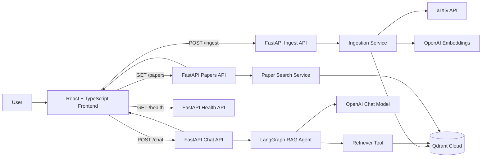
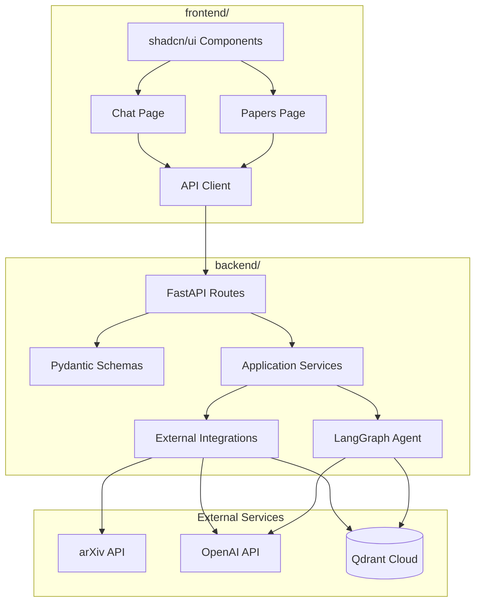
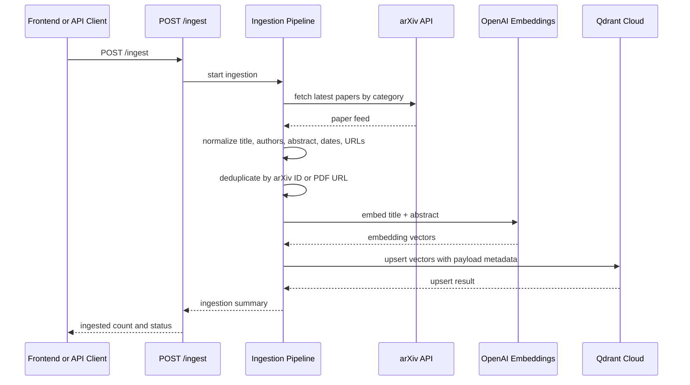
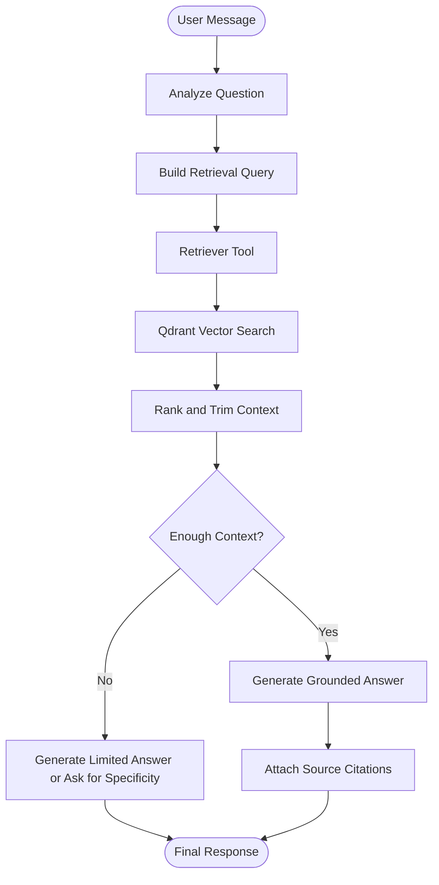
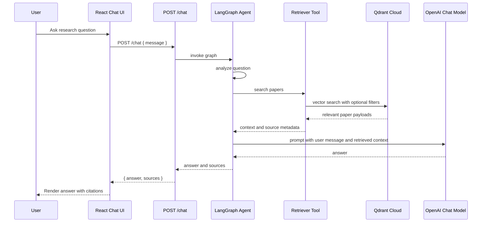
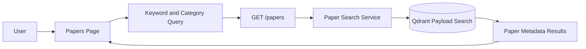
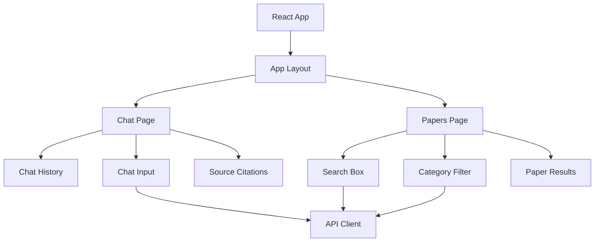
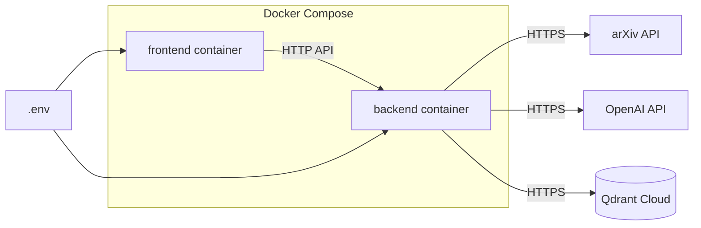

# ResearchOps AI - Architecture

ResearchOps AI is an enterprise-style Agentic RAG application for live AI paper intelligence. It ingests recent AI research papers from arXiv, embeds paper content, stores vectors and metadata in Qdrant Cloud, and exposes a FastAPI backend plus React frontend for search and chat.

This document translates the PRD into an implementation-oriented architecture that stays focused on the portfolio scope: live ingestion, vector search, agentic RAG, source citations, and Dockerized local deployment.

## System Goals

- Ingest at least 100 recent papers from arXiv categories `cs.AI`, `cs.CL`, `cs.LG`, and `cs.IR`.
- Store searchable vector embeddings and paper metadata in Qdrant Cloud.
- Provide a chat API that retrieves relevant papers, generates grounded answers, and returns citations.
- Provide a papers API for keyword and category search over paper metadata.
- Run locally with Docker Compose using environment variables for secrets.

## High-Level Architecture



## Application Layers



## Recommended Project Structure

```text
researchops-ai/
├── backend/
│   ├── api/
│   │   ├── routes_chat.py
│   │   ├── routes_ingest.py
│   │   ├── routes_papers.py
│   │   └── routes_health.py
│   ├── agents/
│   │   ├── graph.py
│   │   ├── state.py
│   │   └── tools.py
│   ├── ingestion/
│   │   ├── arxiv_client.py
│   │   ├── pipeline.py
│   │   └── normalizer.py
│   ├── services/
│   │   ├── embeddings.py
│   │   ├── qdrant_store.py
│   │   ├── paper_search.py
│   │   └── rag_service.py
│   ├── core/
│   │   ├── config.py
│   │   └── logging.py
│   ├── schemas/
│   │   ├── chat.py
│   │   ├── ingest.py
│   │   └── papers.py
│   ├── main.py
│   └── Dockerfile
├── frontend/
│   ├── src/
│   │   ├── api/
│   │   ├── components/
│   │   ├── pages/
│   │   ├── types/
│   │   └── main.tsx
│   └── Dockerfile
├── docs/
│   ├── PRD.md
│   └── architecture.md
├── docker-compose.yml
├── README.md
└── pyproject.toml
```

## Backend Design

### FastAPI Routes

| Route | Method | Responsibility |
| --- | --- | --- |
| `/health` | `GET` | Return service health status. |
| `/ingest` | `POST` | Fetch recent arXiv papers, embed them, and upsert vectors into Qdrant. |
| `/chat` | `POST` | Run the Agentic RAG workflow and return an answer with sources. |
| `/papers` | `GET` | Search paper metadata by keyword and category. |

### Service Boundaries

- `ingestion/`: owns arXiv fetching, paper normalization, deduplication, and ingestion orchestration.
- `services/embeddings.py`: owns OpenAI embedding calls.
- `services/qdrant_store.py`: owns collection setup, vector upsert, vector search, and metadata filtering.
- `services/paper_search.py`: owns `/papers` keyword and category search.
- `services/rag_service.py`: thin orchestration layer between the API route and LangGraph agent.
- `agents/`: owns agent state, graph nodes, retrieval tool, and final response generation.
- `core/config.py`: centralizes `OPENAI_API_KEY`, `QDRANT_URL`, `QDRANT_API_KEY`, and `ARXIV_BASE_URL`.

## Data Ingestion Flow



### Ingestion Record Shape

Each Qdrant point should store the embedding vector plus payload metadata:

```json
{
  "id": "arxiv:2401.00001",
  "vector": [0.0123, -0.0456],
  "payload": {
    "title": "Paper title",
    "authors": ["Author One", "Author Two"],
    "abstract": "Paper abstract...",
    "published_date": "2026-05-30",
    "pdf_url": "https://arxiv.org/pdf/...",
    "category": "cs.AI",
    "source": "arxiv"
  }
}
```

## Agentic RAG Flow

The chat workflow should be implemented as a small LangGraph graph. The graph is intentionally simple because the PRD excludes complex multi-agent systems.



### Agent State

```text
AgentState
├── user_message: str
├── retrieval_query: str
├── retrieved_papers: list[PaperContext]
├── answer: str
└── sources: list[Source]
```

### Agent Nodes

| Node | Purpose |
| --- | --- |
| `analyze_question` | Identify the user's research intent, key terms, and likely categories. |
| `retrieve_context` | Call the retriever tool to search Qdrant. |
| `grade_context` | Decide whether retrieved papers are relevant enough to answer. |
| `generate_answer` | Use retrieved context to produce a concise, grounded answer. |
| `format_sources` | Return title and URL citations in the API response. |

## Chat Request Flow



## Search Flow



## API Contracts

### `GET /health`

Response:

```json
{
  "status": "ok"
}
```

### `POST /ingest`

Suggested request:

```json
{
  "limit": 100,
  "categories": ["cs.AI", "cs.CL", "cs.LG", "cs.IR"]
}
```

Suggested response:

```json
{
  "status": "ok",
  "ingested_count": 100,
  "skipped_count": 0
}
```

### `POST /chat`

Request:

```json
{
  "message": "What are the latest papers about agentic RAG?"
}
```

Response:

```json
{
  "answer": "A grounded answer based on retrieved papers.",
  "sources": [
    {
      "title": "Paper title",
      "url": "https://arxiv.org/pdf/..."
    }
  ]
}
```

### `GET /papers`

Query parameters:

```text
keyword=rag
category=cs.AI
```

Response:

```json
{
  "papers": [
    {
      "title": "Paper title",
      "authors": ["Author One"],
      "published_date": "2026-05-30",
      "url": "https://arxiv.org/pdf/...",
      "category": "cs.AI"
    }
  ]
}
```

## Frontend Design



Frontend responsibilities:

- Render an Apple-inspired minimal interface with white background, rounded cards, and soft shadows.
- Support chat history and source citation rendering.
- Support streaming responses if the backend exposes streaming later.
- Provide a papers page with search and category filtering.
- Keep API access in a dedicated client module so endpoints are not scattered across components.

## Deployment Architecture



Required environment variables:

```text
OPENAI_API_KEY=
QDRANT_URL=
QDRANT_API_KEY=
ARXIV_BASE_URL=
```

Suggested frontend environment variable:

```text
VITE_API_BASE_URL=http://localhost:8000
```

## Runtime Concerns

- Logging: log ingestion counts, external API failures, retrieval latency, and chat request IDs.
- Timeouts: apply external API timeouts for arXiv, OpenAI, and Qdrant calls.
- Deduplication: use stable arXiv IDs as Qdrant point IDs to avoid duplicate ingestion.
- Response time: keep chat retrieval top-k small, for example 5 to 8 papers, to target responses under 5 seconds.
- Secrets: load credentials from environment variables only; never hard-code API keys.
- Error handling: return clear API errors for missing configuration, failed ingestion, and empty search results.

## Implementation Milestones

1. Build FastAPI skeleton with `/health`.
2. Add Qdrant connection and collection initialization.
3. Add arXiv ingestion pipeline and `/ingest`.
4. Add `/papers` metadata search.
5. Add LangGraph RAG agent and `/chat`.
6. Build React chat page and papers page.
7. Add Dockerfiles and `docker-compose.yml`.
8. Update README with setup, environment variables, and demo flow.
